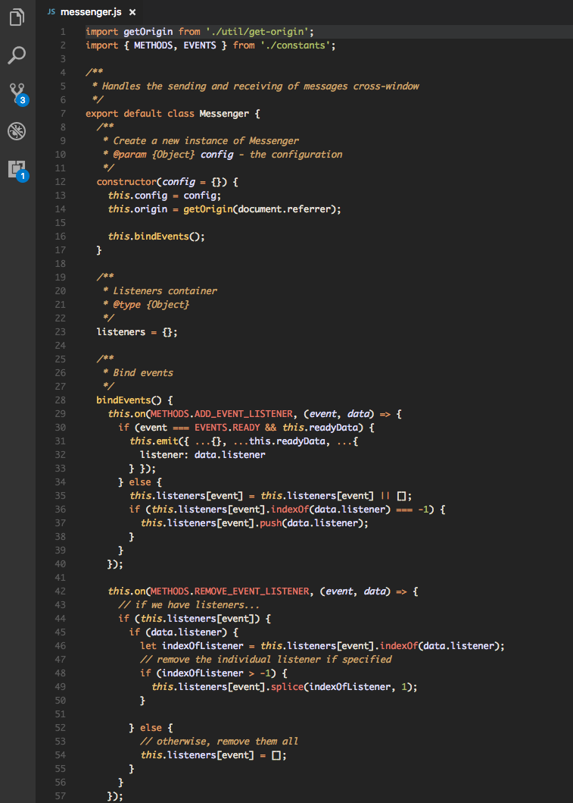

# CombinedCasts theme for VS Code

A theme in the _spirit_ of the [CombinedCasts](https://github.com/hiltmon/textmate-theme-csv) TextMate theme by [Hilton Lipschitz](http://hiltmon.com/) for use in [Visual Studio Code](https://code.visualstudio.com/).

## Installation

Open the Quick Open menu (`⌘+P`, `cmd+P`, or `ctrl+P`). Then enter...

```
ext install combinedcasts
```

## Screenshots


